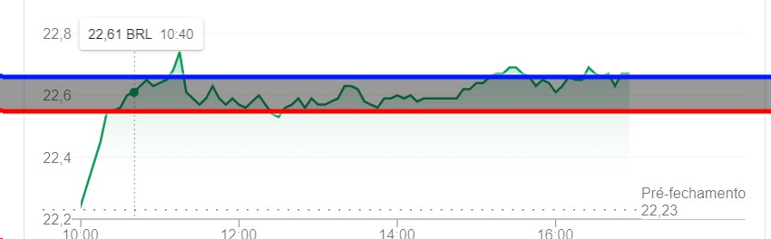

# Desafio Inoa C#

## Requisitos

O objetivo do sistema é avisar, via e-mail, caso a cotação de um ativo da B3 caia mais do que certo nível, ou suba acima de outro.

O programa deve ser uma aplicação de console (não há necessidade de interface gráfica).

Ele deve ser chamado via linha de comando com 3 parâmetros.

1. O ativo a ser monitorado
2. O preço de referência para venda
3. O preço de referência para compra

Ex:

> stock-quote-alert.exe PETR4 22.67 22.59

Ele deve ler de um arquivo de configuração com:

1. O e-mail de destino dos alertas
2. As configurações de acesso ao servidor de SMTP que irá enviar o e-mail

A escolha da API de cotação é livre.

O programa deve ficar continuamente monitorando a cotação do ativo enquanto estiver rodando.

Em outras palavras, dada a cotação de PETR4 abaixo.

Toda vez que o preço for maior que linha-azul, um e-mail deve ser disparado aconselhando a venda.

Toda vez que o preço for menor que linha-vermelha, um e-mail deve ser disparado aconselhando a compra.

Features extras são bem vindas, boas práticas e patterns também ;)

## Primeiros Passos

Para facilitar o uso da API, é possível no momento acessar a **[Documentação](swagger)** que contém todos os seus *endpoints*.

### Pré requisitos

* Faça o download da última versão .NET [.NET 5.0 SDK](https://dotnet.microsoft.com/download)
* [Saiba mais sobre .NET](https://docs.microsoft.com/dotnet/fundamentals/)

> dotnet --version

### Instalando

> dotnet restore

## Autores

* **Fábio Trevizolo** - *Desenvolvedor* - [FabioTS](https://github.com/FabioTS)
